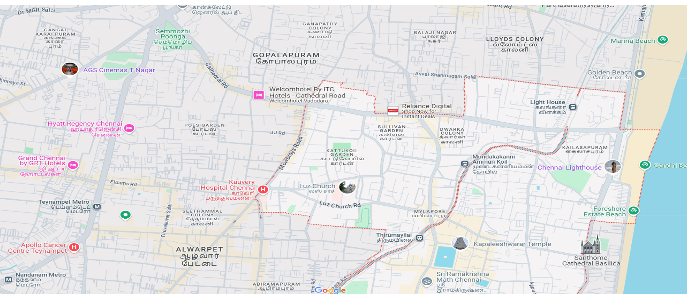
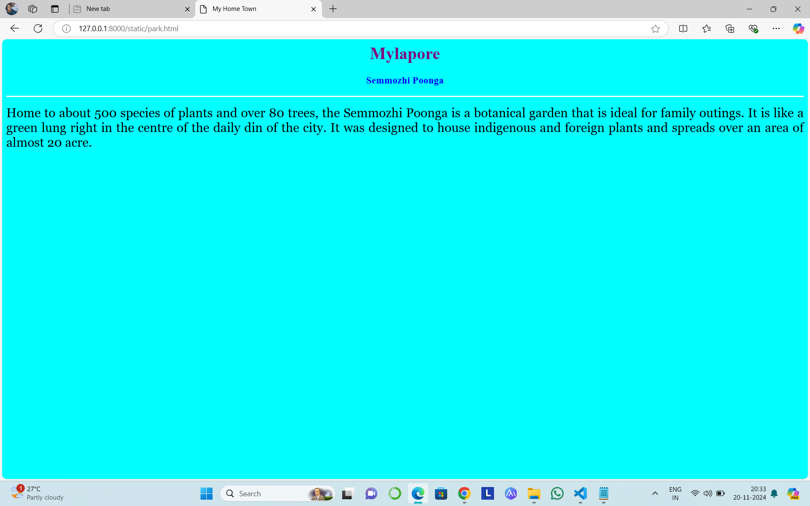
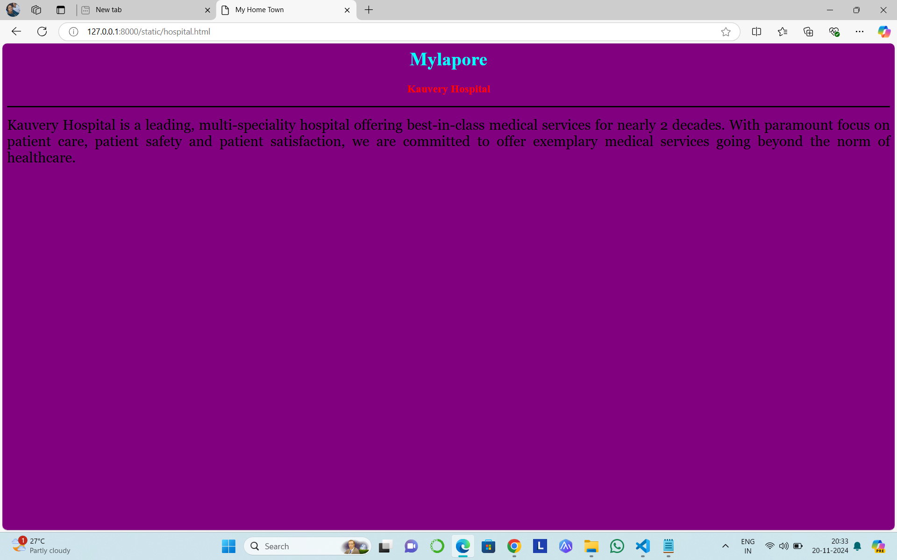
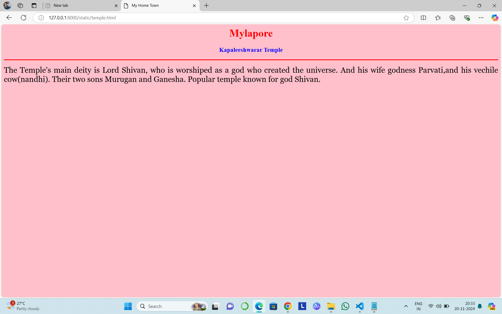
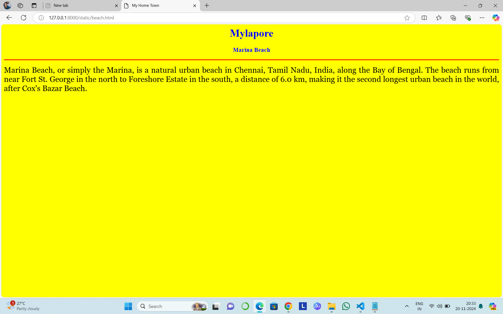
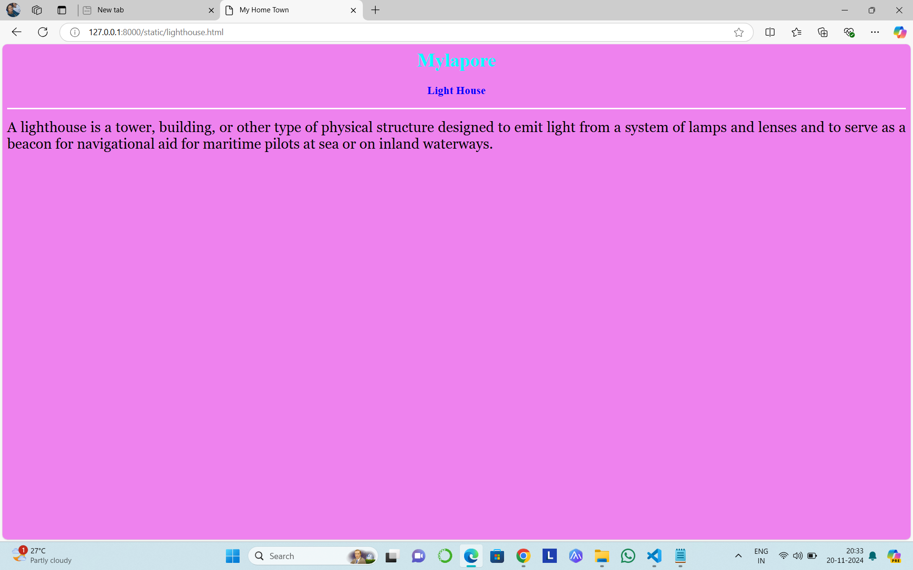
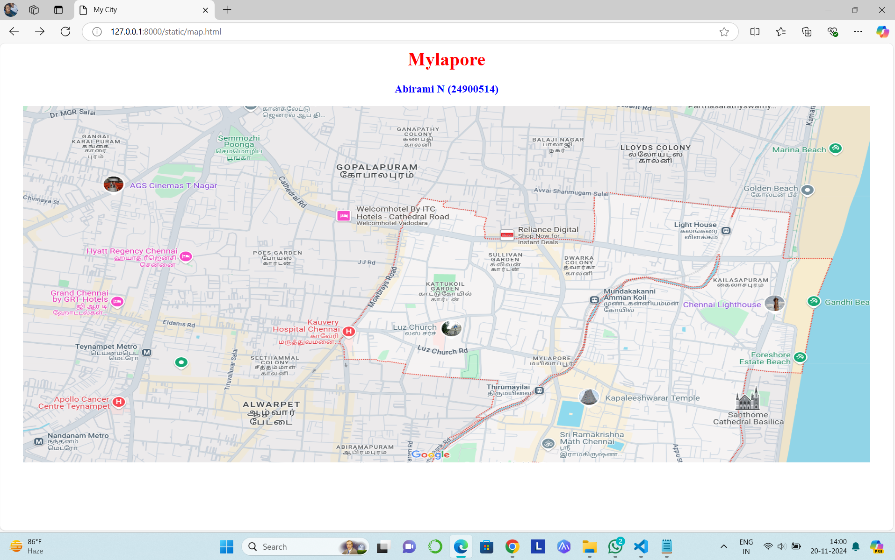

# Ex04 Places Around Me
## Date: 20.11.2024

## AIM
To develop a website to display details about the places around my house.

## DESIGN STEPS

### STEP 1
Create a Django admin interface.

### STEP 2
Download your city map from Google.

### STEP 3
Using ```<map>``` tag name the map.

### STEP 4
Create clickable regions in the image using ```<area>``` tag.

### STEP 5
Write HTML programs for all the regions identified.

### STEP 6
Execute the programs and publish them.

## CODE
```
map.html

<html>
<head>
<title>My City</title>
</head>
<body>
<h1 align="center">
<font color="red"><b>Mylapore</b></font>
</h1>
<h3 align="center">
<font color="blue"><b>Abirami N (24900514)</b></font>
</h3>
<center>
     
<map name="image-map">
    <area target="" alt="park" title="park" href="park.html" coords="100,42,539,172" shape="rect">
    <area target="" alt="beach" title="beach" href="beach.html" coords="573,58,1735,298,1781,79" shape="poly">
    <area target="" alt="temple" title="temple" href="temple.html" coords="1091,549,119" shape="circle">
    <area target="" alt="hospital" title="hospital" href="hospital.html" coords="546,474,94" shape="circle">
    <area target="" alt="lighthouse" title="lighthouse" href="lighthouse.html" coords="1094,165,1355,368" shape="rect">
</map>
</center>
</body>
</html>


park.html


<html>
<head>
<title>My Home Town</title>
</head>
<body bgcolor="cyan">
<h1 align="center">
<font color="purple"><b>Mylapore</b></font>
</h1>
<h3 align="center">
<font color="blue"><b>Semmozhi Poonga</b></font>
</h3>
<hr size="3" color="white">
<p align="justify">
<font face="Georgia" size="5">
    Home to about 500 species of plants and over 80 trees, the Semmozhi Poonga is a botanical garden that is ideal for family outings. It is like a green lung right in the centre of the daily din of the city. It was designed to house indigenous and foreign plants and spreads over an area of almost 20 acre.
</p>
</body>
</html>


lighthouse.html


<html>
<head>
<title>My Home Town</title>
</head>
<body bgcolor="violet">
<h1 align="center">
<font color="cyan"><b>Mylapore</b></font>
</h1>
<h3 align="center">
<font color="blue"><b>Light House</b></font>
</h3>
<hr size="3" color="white">
<p align="justify">
<font face="Georgia" size="5">
A lighthouse is a tower, building, or other type of physical structure designed to emit light from a system of lamps and lenses and to serve as a beacon for navigational aid for maritime pilots at sea or on inland waterways.
</p>
</body>
</html>


hospital.html


<html>
<head>
<title>My Home Town</title>
</head>
<body bgcolor="purple">
<h1 align="center">
<font color="cyan"><b>Mylapore</b></font>
</h1>
<h3 align="center">
<font color="red"><b>Kauvery Hospital</b></font>
</h3>
<hr size="3" color="black">
<p align="justify">
<font face="Georgia" size="5">
Kauvery Hospital is a leading, multi-speciality hospital offering best-in-class medical services for nearly 2 decades. With paramount focus on patient care, patient safety and patient satisfaction, we are committed to offer exemplary medical services going beyond the norm of healthcare.
</p>
</body>
</html>


temple.html

<html>
<head>
<title>My Home Town</title>
</head>
<body bgcolor="pink">
<h1 align="center">
<font color="red"><b>Mylapore</b></font>
</h1>
<h3 align="center">
<font color="blue"><b>Kapaleeshwarar Temple</b></font>
</h3>
<hr size="3" color="red">
<p align="justify">
<font face="Georgia" size="5">
The Temple's main deity is Lord Shivan, who is worshiped as a god who created the universe. And his wife godness Parvati,and his vechile cow(nandhi). Their two sons
Murugan and Ganesha. Popular temple known for god Shivan.
</p>
</body>
</html>


beach.html

<html>
<head>
<title>My Home Town</title>
</head>
<body bgcolor="yellow">
<h1 align="center">
<font color="blue"><b>Mylapore</b></font>
</h1>
<h3 align="center">
<font color="blue"><b>Marina Beach</b></font>
</h3>
<hr size="3" color="red">
<p align="justify">
<font face="Georgia" size="5">
Marina Beach, or simply the Marina, is a natural urban beach in Chennai, Tamil Nadu, India, along the Bay of Bengal. The beach runs from near Fort St. George in the north to Foreshore Estate in the south, a distance of 6.0 km, making it the second longest urban beach in the world, after Cox's Bazar Beach.
</p>
</body>
</html>
```

## OUTPUT










## RESULT
The program for implementing image maps using HTML is executed successfully.
